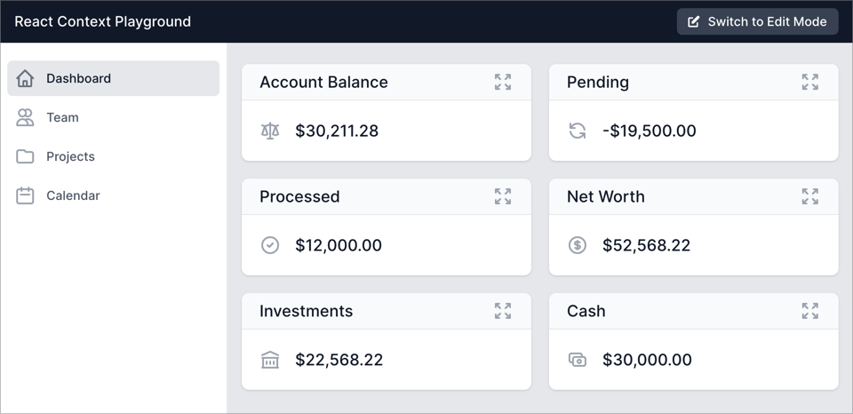
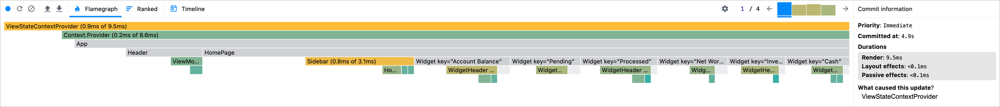

# React Context Playground

A simple app to show how React Context can be optimized to render only the
components that are consuming the context.



In the application above, clicking on the "Switch to Edit Mode" button, puts the
left sidebar into edit mode. Also, the headers of the 6 widgets are put into
edit mode. Clicking the button again brings the app back into view mode. This
feature is enabled by placing a `ViewStateContextProvider` at the root of the
component tree (see [main.tsx](src/main.tsx)). This provider encapsulates the
`viewState` which is toggled by the button. The interesting part is that
although the state in the provider is changing, its immediate children are not
rerendered. Only the context consumers in the component tree are rerendered.
This can be seen in the React profiler flamegraph (see below). Notice that when
the provider gets rerendered, none of its immediate children are rerendering.
Only the `ViewModeToggle` button, the Sidebar and the six `WidgetHeaders` are
rerendering because they are all context consumers.



## Optimization Technique

The basic technique is to return the same element reference from the context
provider as it did the last time. This will make React skip the rerendering of
that particular child. Here's the
[relevant code](src/contexts/ViewStateContext.tsx#L17-L29):

```tsx
function ViewStateContextProvider({ children }: ViewStateContextProviderProps) {
  const [viewState, setViewState] = useState<ViewState>({
    isEditing: false,
  });

  const value = { viewState, setViewState };
  return (
    <ViewStateContext.Provider value={value}>
      {children}
    </ViewStateContext.Provider>
  );
}
```

You can read more about this technique in
[Mark Erikson's article](https://blog.isquaredsoftware.com/2020/05/blogged-answers-a-mostly-complete-guide-to-react-rendering-behavior/#component-render-optimization-techniques).

## Development Build

```bash
npm install
npm run dev
```

Point your browser to http://localhost:3000.

## Production Build

```bash
npm install
npm run build
```
